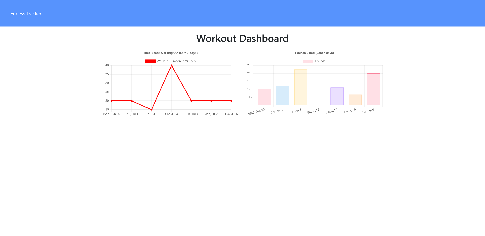

# Healthy-Mongoose 
This application allows you to track your workouts and reach your fitness goals. When you visit you can add exercises to your last workout or make a new one. After adding exercises, you can track your progress via the dashboard. On the dashboard, you will see the combined weight lifted, and the duration for each of the past seven workouts. Healthy Mongoose makes it easy to stay in shape!

## Getting Started:

### [Healthy Mongoose Website](https://healthy-mongoose.herokuapp.com/)

If you want to edit this app you must have a Github account, have downloaded Node.js, MongoDB, Robo 3T, and Visual Studio Code.

- Create a Github account here: [Github](https://github.com/)
- Download Visual Studio here: [Visual Studio](https://code.visualstudio.com/download/)
- Download MongoDB here: [MongoDB](https://www.mongodb.com/)
- Download Robo 3T here: [Robo 3T](https://robomongo.org/)
- Download Node: [Node.js](https://nodejs.org/en/)
- Repository link: [Healthy Mongoose Repo](https://github.com/scottgeleas/Healthy-Mongoose)

 ### Authors:

 Scott Geleas

 ### Built With:

- Javascript
- Node.js
- Express.js
- MongoDB
- Mongoose
- Robo 3T
- Visual Studio Code

 ### Acknowledgments:

University of New Hampshire Coding Bootcamp

Website icon made by [Freepik](https://www.freepik.com) from [Flaticon](https://www.flaticon.com/)

 ### License: 
 

Copyright (c) [2021] [Scott Geleas]]

Permission is hereby granted, free of charge, to any person obtaining a copy
of this software and associated documentation files (the "Software"), to deal
in the Software without restriction, including without limitation the rights
to use, copy, modify, merge, publish, distribute, sublicense, and/or sell
copies of the Software, and to permit persons to whom the Software is
furnished to do so, subject to the following conditions:

The above copyright notice and this permission notice shall be included in all
copies or substantial portions of the Software.

THE SOFTWARE IS PROVIDED "AS IS", WITHOUT WARRANTY OF ANY KIND, EXPRESS OR
IMPLIED, INCLUDING BUT NOT LIMITED TO THE WARRANTIES OF MERCHANTABILITY,
FITNESS FOR A PARTICULAR PURPOSE AND NONINFRINGEMENT. IN NO EVENT SHALL THE
AUTHORS OR COPYRIGHT HOLDERS BE LIABLE FOR ANY CLAIM, DAMAGES OR OTHER
LIABILITY, WHETHER IN AN ACTION OF CONTRACT, TORT OR OTHERWISE, ARISING FROM,
OUT OF OR IN CONNECTION WITH THE SOFTWARE OR THE USE OR OTHER DEALINGS IN THE
SOFTWARE.

